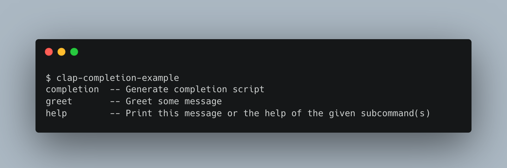
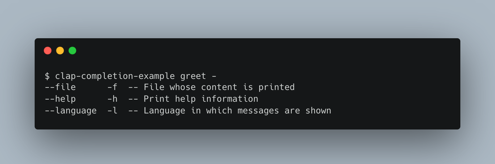
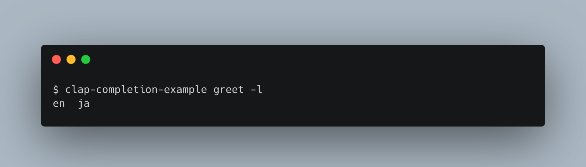
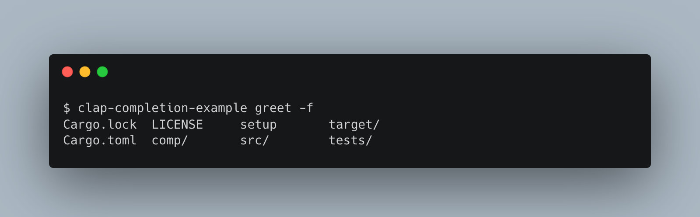

# clapでシェル補完スクリプトを生成する

この記事では、2022年1月にリリースされたclapバージョン3とclap_completeクレートを使って、シェルの補完スクリプトを生成する方法を紹介します。

## はじめに

[clap](https://crates.io/crates/clap)はRustのコマンドライン引数パーサーです。
近年の他のプログラミング言語のコマンドライン引数パーサー——例えば、Pythonの[argcomplete](https://pypi.org/project/argcomplete/)、[click](https://click.palletsprojects.com/en/8.0.x/)や[cleo](https://pypi.org/project/cleo)、Goの[go-flags](https://pkg.go.dev/github.com/jessevdk/go-flags)——同様に、補完スクリプトの生成に対応しています。

clapはBuilderパターンによるパーサーの構築が素の使い方ですが、バージョン3でderiveマクロによるパーサーの構築が安定化されました。
Builderパターンによるパーサーの構築——この機能はBuilder APIと呼ばれています——では、以下のようなコードでパーサーを記述します。[構造体`App`](https://docs.rs/clap/latest/clap/struct.App.html)がビルダーであり、そのメソッドを呼び出すことで引数を追加していきます。

```rust
use clap::App;

let app = App::new("example")
    .arg(
        Arg::new("verbose")
            .short('v')
            .help("enable verbose mode")
    )
    .arg(
        Arg::new("file")
            .index(1)
    );
```

一方、deriveマクロによるパーサーの構築——この機能はDerive APIと呼ばれています——では、構造体に属性を付けることで引数を設定します。コマンドライン引数のパースに成功すると、deriveマクロを使った構造体にパースされた結果が格納されます。

```rust
use clap::Parser;

#[derive(Parser)]
struct Args {
    file: PathBuf,
    /// enable verbose mode
    #[clap(short, long)]
    verbose: bool,
}
```

clapには[clap_complete](https://crates.io/crates/clap_complete)という関連するクレートがあります。clap_completeを使うことで、構築したパーサーからシェル補完スクリプトを自動で生成することができます。

clapとclap_completeを使ってシェル補完スクリプトを生成する方法について、次の流れで説明します。

1. 補完スクリプトの対象となる簡単なCLIプログラムを作成する。
2. clap_completeの使い方を解説し、補完スクリプトを生成するサブコマンドを実装する。
3. 生成した補完スクリプトをzshで使用する。

なお、この記事ではDerive APIの使い方について詳細な説明は行いません。[structopt](https://crates.io/crates/structopt)を使った経験があることを前提にします。

執筆に利用したRustやclap等のバージョンは以下の通りです。

| Name | Version |
|------|---------|
| Rust | 1.57.0  |
| clap | 3.0.5   |
| clap_complete | 3.0.2 |
| zsh | 5.8 (x86_64-apple-darwin21.0) |

本文中で紹介するプログラムのソースコードは[horatos/clap-completion-example](https://github.com/horatos/clap-completion-example)にあります。

## メッセージを表示するプログラムを作成する

サンプルとして使うためのプログラムとして、メッセージを表示するだけのプログラムを作成します。この部分はこの記事の本題ではないので仕様とコードを掲載するだけにとどめます。

### メッセージを表示するプログラムの仕様

`greet`サブコマンドでメッセージを表示することにします。後で補完スクリプトを生成するための`completion`サブコマンドを追加するため、サブコマンドを分けることにします。

`greet`サブコマンドに引数が渡されたなかったときは、`Hello`を表示します。

```console
$ cargo run -- greet
Hello
```

`greet`サブコマンドに`-l LANGUAGE`または`--language LANGUAGE`オプションを渡すと、メッセージを表示する言語を変更します。このオプションの値`LANGUAGE`は`en`か`ja`のいずれかです。

```console
$ cargo run -- greet -l en
Hello
$ cargo run -- greet -l ja
こんにちは
```

`greet`サブコマンドに`-f FILE`または`--file FILE`オプションを渡すと、値`FILE`の内容を表示します。このオプションは`-l`オプションと併用できません。

```console
$ cargo run -- greet -f hey.txt
（hey.txtの内容が表示される。ただし、末尾の空白文字は取り除かれる。）
```

### メッセージを表示するプログラムの実装

実装は以下の通りになります。プロジェクト全体は[このリポジトリ](https://github.com/horatos/clap-completion-example/tree/step1)にあります。

```rust
use std::path::PathBuf;

use clap::{ArgEnum, Parser, Subcommand};

/// Greet command (example for clap_complete command).
#[derive(Parser,Debug)]
struct Cli {
    #[clap(subcommand)]
    action: Action,
}

#[derive(Subcommand,Debug)]
enum Action {
    /// Greet some message.
    Greet {
        /// Language in which messages are shown.
        #[clap(long,short,arg_enum)]
        language: Option<Language>,
        /// File whose content is printed.
        ///
        /// The trailing whitespaces of the content are trimmed.
        #[clap(long,short,conflicts_with("language"))]
        file: Option<PathBuf>,
    },
}

#[derive(ArgEnum,Clone,Debug)]
enum Language {
    En,
    Ja,
}

impl Action {
    fn handle(self) {
        use Action::Greet;

        match self {
            Greet { language: None, file: None } => {
                println!("Hello");
            },
            Greet { language: Some(Language::En), .. } => {
                println!("Hello");
            },
            Greet { language: Some(Language::Ja), .. } => {
                println!("こんにちは");
            },
            Greet { file: Some(file), .. } => {
                let s = std::fs::read_to_string(&file).unwrap();
                println!("{}", s.trim_end());
            },
        }
    }
}

fn main() {
    Cli::parse().action.handle();
}
```

## clap_completeクレートを使って補完スクリプトを生成する

前節で作ったプログラムを拡張して補完スクリプトを生成するサブコマンドを追加します。サブコマンドの仕様を考える前にclap_completeが提供する関数やトレイトなどと見ておきましょう。

補完スクリプトの生成は[関数`generate`](https://docs.rs/clap_complete/latest/clap_complete/generator/fn.generate.html)が行います。関数`generate`は以下の四つの引数を受け取ります。

- `gen`
- `app`
- `bin_name`
- `buf`

まず、引数`gen`は[トレイト`Generator`](https://docs.rs/clap_complete/latest/clap_complete/generator/trait.Generator.html)を実装したオブジェクトでなければなりません。clap_completeはこのトレイトを実装する[列挙体`Shell`](https://docs.rs/clap_complete/latest/clap_complete/shells/enum.Shell.html)を提供しています。`Shell`は補完スクリプトの生成に対応しているシェルを表現する列挙体です。

次に、引数`app`は[clapの構造体`App`](https://docs.rs/clap/latest/clap/struct.App.html)のオブジェクトです。Builder APIでパーサーを構築する場合は素直に手に入りますが、Derive APIを使う場合は[トレイト`IntoApp`](https://docs.rs/clap/latest/clap/trait.IntoApp.html)を使うことで構造体`App`のオブジェクトを手に入れられます。

引数`bin_name`はコマンドの名前です。`Into<String>`を実装しているオブジェクトを渡す必要があります。この引数で渡す名前とバイナリの名前を一致させないと、シェルが補完スクリプトを呼び出すことができません。

引数`buf`は`Write`を実装しているオブジェクトを渡す必要があります。スクリプトの書き込み先をこの引数で渡します。

### completionサブコマンドの実装

それでは新しいサブコマンドの実装に移りましょう。`--shell`オプションで対応するシェルを指定することにします。

```console
$ cargo run -- completion --shell zsh
（Zsh用の補完スクリプトが表示される）
```

以下に新しいソースコードを示します。[GitHubで先ほどのコードとのdiff](https://github.com/horatos/clap-completion-example/compare/step1...step2?diff=split#diff-42cb6807ad74b3e201c5a7ca98b911c5fa08380e942be6e4ac5807f8377f87fc)を見ることもできます。

```rust
use std::path::PathBuf;

use clap::{ArgEnum, IntoApp, Parser, Subcommand, ValueHint}; // (1)
use clap_complete::{generate, Generator, Shell}; // (2)

/// Greet command (example for clap_complete command).
#[derive(Parser,Debug)]
struct Cli {
    #[clap(subcommand)]
    action: Action,
}

#[derive(Subcommand,Debug)]
enum Action {
    /// Greet some message.
    Greet {
        /// Language in which messages are shown.
        #[clap(long,short,arg_enum)]
        language: Option<Language>,
        /// File whose content is printed.
        ///
        /// The trailing whitespaces of the content are trimmed.
        #[clap(long,short,conflicts_with("language"),value_hint(ValueHint::FilePath))] // (3)
        file: Option<PathBuf>,
    },
    /// Generate completion script
    Completion { // (4)
        #[clap(long,short,arg_enum)]
        shell: Shell,
    },
}

#[derive(ArgEnum,Clone,Debug)]
enum Language {
    En,
    Ja,
}

impl Action {
    fn handle(self) {
        use Action::*;

        match self {
            Greet { language: None, file: None } => {
                println!("Hello");
            },
            Greet { language: Some(Language::En), .. } => {
                println!("Hello");
            },
            Greet { language: Some(Language::Ja), .. } => {
                println!("こんにちは");
            },
            Greet { file: Some(file), .. } => {
                let s = std::fs::read_to_string(&file).unwrap();
                println!("{}", s.trim_end());
            },
            Completion { shell } => { // (5)
                print_completer(shell);
            },
        }
    }
}

fn print_completer<G: Generator>(generator: G) { // (6)
    let mut app = Cli::into_app();
    let name = app.get_name().to_owned();

    generate(generator, &mut app, name, &mut std::io::stdout());
}

fn main() {
    Cli::parse().action.handle();
}
```

まず、(1)(2)で新しく必要となるトレイトなどをインポートします。

(3)ではバリアント`Greet`の属性に`value_hint(ValueHint::FilePath)`を追加しています。これを追加することでファイルパスのみが補完の候補として出てくるようにすることができます。

(4)ではバリアント`Completion`を追加することでサブコマンドを追加しています。フィールド`shell`の属性に`arg_enum`を付けることで、入力可能な値が`Shell`のバリアントに限定され、補完時の候補もバリアントの名前から選ばれることになります。

(5)ではバリアント`Completion`を処理する手続きを呼び出しています。関数`print_completer`が補完スクリプトを標準出力に書き出します。

(6)では関数`print_completer`が、構造体`Cli`から`App`のオブジェクトを作成して関数`generate`を呼び出しています。

以上で補完スクリプト生成機能の追加は完了です。以下のコマンドを実行することで補完スクリプトが表示されます。

```console
$ cargo run -- completion --shell zsh
```

## 生成した補完スクリプトをzshで使用する

clap_completeで生成した補完スクリプトをzshで使ってみましょう。補完スクリプトのインストールは環境変数`fpath`に設定されたディレクトリにスクリプトを置いてから、関数`compinit`呼び出すことで実現できます。

ただし、開発時には生成し直した補完スクリプトをリロードしたり、必要がなくなった補完スクリプトをアンロードしたりする必要があります。そのあたりをいちいちケアするのは面倒なので、以下の内容のスクリプトを`setup`という名前で保存し、zshを新しく起動して`source setup`を実行することで補完スクリプトをロードします。補完スクリプトが必要でなくなれば`exit`でシェルから抜けるだけでよくなります。

```shell:setup
export fpath=($fpath $(pwd)/comp)
export PS1="${PS1:-} (comp)$ "
alias clap-completion-example=$(pwd)/target/debug/clap-completion-example

mkdir -p comp && \
cargo run -- completion --shell zsh > comp/_clap-completion-example && \
autoload -Uz compinit && \
compinit
```

まず、プロジェクトルート（_Cargo.toml_があるディレクトリ）で以下のコマンドを実行して補完スクリプトをロードしてください。

```console
$ zsh
$ source setup
```

これでビルドしたプログラムを`clap-completion-example`という名前で呼び出せるようになります。

まずは、サブコマンドの補完を試してみましょう。コマンド名の後でタブを入力することで、サブコマンドの候補とヘルプメッセージが表示されます。（以下の画像では、入力の後にタブキーを押しているものだと理解してください。）



次の例は、greetサブコマンドのオプションを補完する例です。



`-l`オプションや`-f`オプションの候補も入力可能な値が候補として表示されます。





## さいごに

簡単な例を通して、clapを使うことでシェルの補完スクリプトを容易に生成できることを見ました。今回はzsh用の補完スクリプトを生成しましたが、clap_completeはbashやPowerShellなどの他のシェルにも対応しています。

`ValueHint`を使うことで補完する値の候補を指定することができることを見ました。ただし、この機能はあらかじめ決められた種類の候補しか指定できません。例えば、Gitの補完で`git checkout`にブランチ名の候補を出すような、コマンドに固有な内容での補完は実現できません。このような補完のサポートは[議論が行われている](https://github.com/clap-rs/clap/issues/1232)ようですが、先に解決しなければならない課題があるようです。実装されるまでにはまだ時間がかかりそうです。
